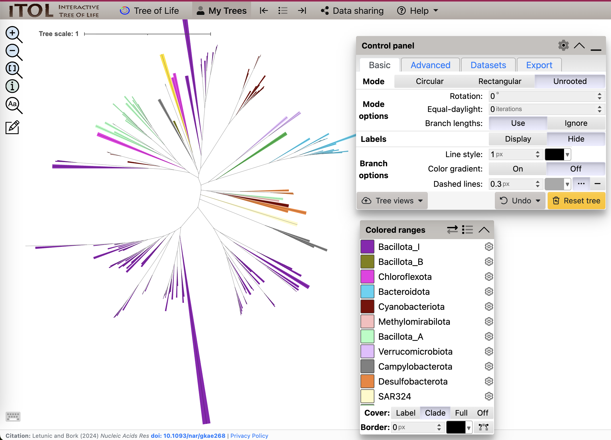
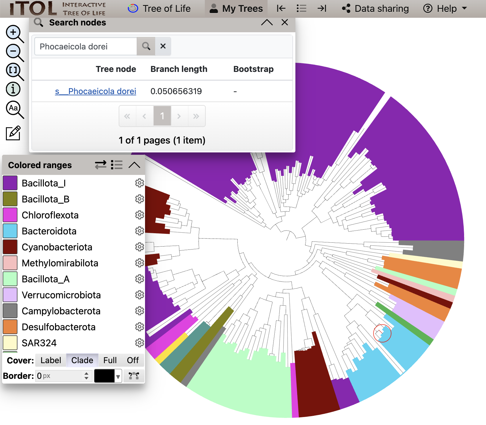

# Answers to MAGs practical

### Binning

MetaBAT2 returned 10 bins. You can count number of sequences with command:
```commandline
grep '>' bin.0.fa | wc -l
```

### CheckM


### CheckM2


### Comparing CheckM and CheckM2

CheckM plot:

CheckM2 plot:


### GTDB-Tk taxonomy

### NCBI taxonomy


### Defining Taxonomy Identifier (TaxID)


| bin    | taxonomy           | taxID |
|--------|--------------------|-------|
| bin.1  | Unclassified Bacteria | 2
| bin.2  | Unclassified Bacteria | 2
| bin.3  | s__Lachnospira eligens | 39485
| bin.4  | s__Bacteroides uniformis | 820
| bin.5  | g__Ruminococcus | 1263
| bin.6  | c__Alphaproteobacteria | 28211
| bin.7  | s__Phocaeicola dorei | 357276
| bin.8  | s__Phocaeicola plebeius | 310297
| bin.9  | Unclassified Bacteria | 2
| bin.10 | f__Lachnospiraceae | 186803


### Visualizing the phylogenetic tree

Unrooted tree



Search for **bin.7**



**Note:**

**bin.5** might have different species name on the tree because taxonomy has changed between versions.
`s__Ruminococcoides intestinalis` can be searched as `s__Ruminococcus_E intestinalis`

**bin.6** is missing in the tree :)